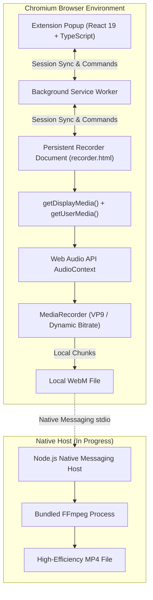

<div align="center">

# ScreenRecorder

### High-quality, privacy-first screen recording for Chromium browsers.

Capture your screen, browser tabs, windows, microphone, and system audio entirely locally. Built with a decoupled Manifest V3 architecture and designed for an upcoming native FFmpeg processing pipeline.

[](LICENSE)
[](https://developer.chrome.com/docs/extensions/develop/migrate/what-is-mv3)
[](https://www.typescriptlang.org/)
[](https://react.dev/)
[](https://github.com/SSRNServices/screen-recorder/actions/workflows/ci.yml)

[Features](#features) · [Architecture](#architecture) · [Quality Engine](#quality-engine) · [Installation](#installation) · [Development](#development) · [Roadmap](#roadmap)

</div>

---

## Overview

**ScreenRecorder** is a local-first screen capture application engineered to solve the primary weaknesses of browser-based recorders: aggressive compression, blurry text, lost recordings when popups close, and forced cloud dependencies.

All recording data remains 100% on your local machine. No accounts, no cloud uploads, no subscriptions, and zero tracking.

```text
                  SCREENRECORDER
        ──────────────────────────────────
          High-Fidelity Screen Capture
               for Chromium Browsers

         Local-First • Private • Open Source
```

---

## Preview

```text
┌──────────────────────────────────────────────┐
│  ● ScreenRecorder                     ⚙      │
├──────────────────────────────────────────────┤
│  CAPTURE SOURCE                              │
│  ┌──────────────┬──────────────┬──────────┐  │
│  │  [■] Screen  │  [◫] Window  │  [⇱] Tab │  │
│  └──────────────┴──────────────┴──────────┘  │
│                                              │
│  RECORDING QUALITY                           │
│  Profile: High (~25 Mbps)                    │
│  FPS: Auto (Native)                          │
│  Resolution: Source (Native)                 │
│                                              │
│  AUDIO SOURCES                               │
│  Microphone                          [●]     │
│  System / Tab Audio                  [●]     │
│                                              │
│         [  ●  Start Recording  ]             │
├──────────────────────────────────────────────┤
│  🛡️ Local • No Upload            Status: Ready│
└──────────────────────────────────────────────┘
```

---

## Key Features

| Capability | Status | Description |
| :--- | :---: | :--- |
| **Full Display Capture** | Available | Capture any attached monitor or display at native resolution. |
| **Window & Tab Capture** | Available | Record individual application windows or specific browser tabs. |
| **Audio Mixing** | Available | Simultaneously mix microphone input with tab/system audio using Web Audio API. |
| **High-Bitrate VP9 Engine** | Available | Preserves fine text, code, terminal outputs, and detailed UI interfaces. |
| **Popup-Resilient Lifecycle** | Available | Recording runs in a persistent session; closing or unfocusing the popup will not abort the session. |
| **Drift-Free Elapsed Timer** | Available | Accurately calculates elapsed recording duration across pause, resume, and background throttling. |
| **Smart Anti-Upscaling** | Available | Preserves exact source pixels; never performs artificial upscaling. |
| **Native FFmpeg Transcoding** | In Progress | Native host integration for high-performance H.264 MP4 export and compression. |
| **Webcam Overlay** | Planned | Circular or rectangular picture-in-picture webcam compositing. |
| **Recording Library** | Planned | Persistent local recording history with thumbnails, metadata inspection, and deletion. |

---

## Why ScreenRecorder?

* **Local-First & Offline**: Traditional browser recording extensions upload your footage to third-party cloud backends. ScreenRecorder encodes and exports your recordings directly to your workstation's disk.
* **Text & UI Clarity**: Standard WebRTC recording implementations often omit bitrate constraints, leading Chromium to default to ~2 Mbps. ScreenRecorder dynamically calculates bitrates based on source resolution and frame rate (up to 35–80 Mbps on Ultra profile), keeping small text, code, and map labels crisp.
* **Decoupled Architecture**: In Chromium extensions, popup windows automatically close when unfocused. ScreenRecorder coordinates sessions through a persistent background recording document and `chrome.storage.session`, guaranteeing uninterrupted long-form capture.
* **Principle of Least Privilege**: Does not request invasive permissions (`<all_urls>`, `webRequest`, `cookies`, `tabs`). Only requests `storage` and `downloads`.

---

## Architecture

ScreenRecorder separates browser media acquisition from native desktop processing:



### Recording Lifecycle

1. **Selection**: User configures capture source, audio inputs, quality tier, and clicks **Start Recording**.
2. **Stream Acquisition**: The browser's native picker prompts the user to select the screen, window, or tab.
3. **Source Inspection**: Native track dimensions (`width`, `height`, `frameRate`, `displaySurface`) are inspected via `videoTrack.getSettings()`.
4. **Parameter Calculation**: The dynamic quality engine calculates optimal video bitrates (scaled by pixel count and frame rate multiplier) and verifies audio-aware MIME compatibility.
5. **Stream Assembly**: System audio and microphone tracks are mixed into an `AudioDestinationNode` without clipping.
6. **Capture**: `MediaRecorder` buffers stream slices safely using 1000ms timeslices.
7. **Finalization**: When recording stops (or the user clicks the browser's native "Stop sharing" bar), all chunks are assembled into a `.webm` file and saved via the download manager.

---

## Quality Engine

Bitrates are computed dynamically according to the active quality profile, native pixel count, and frame rate:

| Quality Profile | 1080p Baseline | 1440p Baseline | 4K (2160p) Baseline | Audio Bitrate |
| :--- | :---: | :---: | :---: | :---: |
| **Standard** | ~18 Mbps | ~28 Mbps | ~45 Mbps | 192 kbps |
| **High** *(Default)* | ~25 Mbps | ~40 Mbps | ~60 Mbps | 256 kbps |
| **Ultra** | ~35 Mbps | ~50 Mbps | ~80 Mbps | 256 kbps |

* **Frame Rate Multiplier**:
  * $\ge 55\text{ FPS}$: `1.25x` (e.g., 1080p60 on High profile $\approx 31.25\text{ Mbps}$)
  * $45\text{--}54\text{ FPS}$: `1.15x`
  * $25\text{--}44\text{ FPS}$: `1.00x` (e.g., 1080p30 on High profile $\approx 25\text{ Mbps}$)
  * $< 25\text{ FPS}$: `0.85x`
* **Codec Selection Order**: `video/webm;codecs=vp9,opus` $\rightarrow$ `video/webm;codecs=vp8,opus` $\rightarrow$ `video/webm;codecs=h264,opus` $\rightarrow$ `video/webm`.

---

## Privacy by Design

* **No Cloud Transits**: ScreenRecorder contains zero telemetry, zero analytics, and zero cloud synchronization code.
* **No Account Required**: The application requires no login, email, or third-party authentication.
* **Local Storage Only**: Preferences are persisted strictly within the browser's isolated `chrome.storage.local`.

---

## Security

* **Least-Privilege Manifest**: The extension requests only `storage` and `downloads`. No broad domain permissions (`<all_urls>`) or history access.
* **Injection-Proof Native Architecture**: The upcoming native messaging protocol strictly accepts structured JSON commands with schema validation. Arbitrary shell command strings (`exec`, `cmd.exe`, `powershell.exe`) are explicitly prohibited; processes are executed solely via `spawn(executablePath, validatedArgsArray)`.
* **Responsible Disclosure**: If you discover a security vulnerability, please review our [Security Policy](SECURITY.md) and report it privately via GitHub Security Advisories.

---

## Browser Support

| Browser | Status | Minimum Version | Notes |
| :--- | :---: | :---: | :--- |
| **Google Chrome** | Supported | 107+ | Full support for display, window, tab, and system audio capture. |
| **Microsoft Edge** | Supported | 107+ | Full support for display, window, tab, and system audio capture. |
| **Brave** | Supported | 1.45+ | Fully compatible with Chromium Manifest V3 APIs. |
| **Mozilla Firefox** | Planned | — | Requires Manifest V2 / V3 compatibility abstraction. |

---

## Project Structure

```text
web-recorder/
├── apps/
│   ├── extension/                  # Chromium Manifest V3 browser extension
│   │   ├── public/                 # Extension icons and manifest.json
│   │   ├── src/
│   │   │   ├── background/         # Background service worker (badge & session sync)
│   │   │   ├── components/         # Segmented source, audio switches, quality controls
│   │   │   ├── hooks/              # useRecordingState, drift-free elapsed timer
│   │   │   ├── popup/              # React 19 UI, design tokens, responsive styles
│   │   │   ├── recorder/           # RecordingController, qualityCalculator, mimeDetector
│   │   │   ├── services/           # Settings persistence and message client
│   │   │   └── utils/              # Time formatters and filename generators
│   │   ├── popup.html              # Extension action popup entry point
│   │   ├── recorder.html           # Persistent recording host document
│   │   └── vite.config.ts          # Multi-entry Vite bundler
│   └── native-host/                # Node.js / TypeScript Native Messaging service
├── packages/
│   └── protocol/                   # Shared TypeScript protocol, schemas, and state machine
├── ffmpeg/                         # FFmpeg documentation and licensing guidelines
├── docs/                           # Architecture, development, native messaging & troubleshooting
├── scripts/                        # Monorepo build and packaging scripts
├── package.json                    # Workspace definitions and unified build scripts
├── pnpm-workspace.yaml             # Workspace package configurations
└── tsconfig.json                   # Strict TypeScript compiler options
```

---

## Installation

### Load Unpacked Extension (Development)

1. Clone the repository and install dependencies:
   ```bash
   git clone https://github.com/SSRNServices/screen-recorder.git
   cd screen-recorder
   npm install
   ```
2. Build the extension bundle:
   ```bash
   npm run build:extension
   ```
3. Open your browser and navigate to the extensions management page:
   * **Chrome**: `chrome://extensions/`
   * **Edge**: `edge://extensions/`
   * **Brave**: `brave://extensions/`
4. Toggle **Developer mode** on (top-right corner).
5. Click **Load unpacked** and select the built directory:
   ```text
   <path-to-repo>/apps/extension/dist
   ```
6. Click the ScreenRecorder icon in your browser toolbar to begin recording.

---

## Development Workflow

### Available Scripts

Run from the root directory:

```bash
# Type check all packages in strict mode
npm run typecheck

# Run static analysis
npm run lint

# Execute all unit test suites
npm test

# Build all monorepo packages
npm run build

# Build extension with hot reload in dev server
npm run dev

# Validate artifact integrity and manifest schema
npm run validate:artifacts

# Package production bundle and generate SHA-256 checksums
npm run package
```

### Continuous Integration & Release Automation

Every commit pushed to `main` and all Pull Requests are automatically verified by GitHub Actions:

* **CI (`.github/workflows/ci.yml`)**: Compiles all packages in strict TypeScript, runs linting, executes Vitest unit/integration suites, builds production bundles, performs artifact schema validation, runs security audits, and packages preview artifacts.
* **Windows Build (`.github/workflows/windows-build.yml`)**: Runs matrix tests on `windows-latest` to validate native path handling and packaging.
* **Automated Releases (`.github/workflows/release.yml`)**: Tagging a release (`git tag v0.1.0 && git push origin v0.1.0`) triggers an automated build that verifies version parity across `package.json` and `manifest.json`, builds verified zip bundles, calculates cryptographic SHA-256 checksums, and attaches assets to a GitHub Release.

### Branch Strategy

ScreenRecorder maintains a single permanent branch: `main`. Release distributions are delivered via semantic Git tags (`v*.*.*`). Automated dependency-update bots are disabled, ensuring no persistent or unsolicited bot branches exist.


---

## Technology Stack

| Technology | Purpose |
| :--- | :--- |
| **TypeScript** | Strict static type safety across all packages and services |
| **React 19** | Modern, declarative component UI for extension popup |
| **Vite 6** | Fast development server and optimized multi-entry Rollup bundler |
| **Manifest V3** | Current Chromium extension security and lifecycle platform |
| **MediaStream Recording API** | High-performance in-browser media capture and chunk buffering |
| **Web Audio API** | Hardware-accelerated audio mixing and gain control |
| **Chromium Native Messaging** | Length-prefixed stdio communication bridge *(In Progress)* |
| **FFmpeg** | High-efficiency native transcoding and MP4 packaging *(In Progress)* |

---

## Roadmap

- [x] Chromium Manifest V3 browser extension
- [x] Persistent recorder tab architecture (resilient to popup closure)
- [x] Multi-source capture: Entire Display, Application Window, Browser Tab
- [x] Dual-channel audio capture (Microphone + System Audio mixer)
- [x] Dynamic high-bitrate calculation engine (18–80 Mbps)
- [x] Native display resolution inspection and anti-upscaling protection
- [x] Settings persistence (`chrome.storage.local`)
- [x] Structured error handling with technical diagnostic view
- [ ] Native Messaging Host implementation (Phase 2)
- [ ] Bundled FFmpeg processing engine (Phase 3)
- [ ] High-efficiency H.264 / AAC MP4 export
- [ ] Camera picture-in-picture overlay
- [ ] Local recording library with thumbnail generation
- [ ] Windows NSIS / Inno Setup installer

---

## Contributing

We welcome contributions! Please read our [Contributing Guide](CONTRIBUTING.md) for branch naming conventions, development guidelines, and pull request procedures.

---

## License

This project is licensed under the **MIT License** — see the [LICENSE](LICENSE) file for details.

### Third-Party & FFmpeg Licensing
* The ScreenRecorder browser extension and native host protocol are distributed under the MIT license.
* Future native bundles will interface with FFmpeg as a separate subprocess via standard process boundaries. FFmpeg is licensed under the LGPL v2.1+ / GPL v2+. Refer to [`ffmpeg/README.md`](ffmpeg/README.md) for details.

---

<div align="center">

Built for local, high-quality, privacy-first screen recording.

</div>
